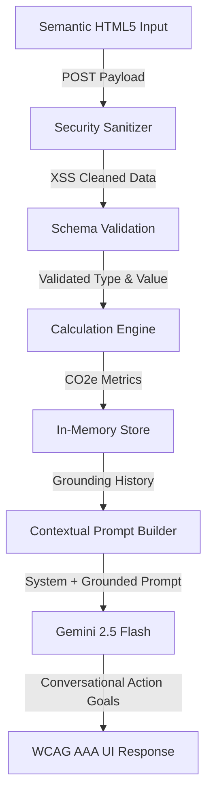

# 🌍 Carbon Footprint Awareness Platform

An enterprise-ready, security-hardened full-stack application designed to track carbon emission metrics and deliver personalized, contextual reduction strategies using generative AI.

---

## 🎯 The Vertical & Persona

### The Vertical: The Urban Professional & Daily Commuter
Modern urban professionals living in metropolitan areas rely heavily on public and private transportation, digital services, and convenience-oriented lifestyles. While aware of climate change, these users face high friction when trying to calculate their ecological impact or apply generic sustainability advice.

### The Persona: The Eco-Curious Metropolitan Commuter
*   **Context:** Commutes daily, utilizes grid-powered smart homes, and consumes a mix of convenience meals.
*   **Behavioral Needs:** Requires a low-friction tracking mechanism and actionable, context-grounded suggestions that integrate easily into a busy work-life routine.
*   **Platform Goal:** Provide instant visual tracking of daily actions and real-time micro-goals through an intelligent chatbot grounded in their actual data.

---

## 🧠 Approach and Logic

### Architectural Overview
The platform is designed around a decoupled, modular **MVC (Model-View-Controller) architecture**:
-   **Model (State Service):** An in-memory data store containing validated and structured user activities.
-   **View (Semantic Frontend):** A lightweight single-page interface built using semantic HTML5, compliant with WCAG 2.1 AAA standards.
-   **Controller (Express Application):** Secure endpoints managing routing, input sanitization, emission math, and AI prompting.

### Dynamic Context-Grounded Assistant
Instead of relying on rigid, pre-programmed rule matrices or static feedback forms, the assistant leverages **Gemini 2.5 Flash** (via the official Google Gen AI SDK). 
1.  When a user prompts the chatbot, the backend queries the local state service for the user's historical log.
2.  The raw metrics (transport distance, dietary profile, utility consumption) are compiled into a structured prompt.
3.  This structured grounding profile is sent directly into the Gemini model's context window.
4.  The model acts as an intelligent agent, synthesizing current user progress and returning highly tailored, achievable micro-goals.

### Deployment & Scalability
The platform is fully containerized using a multi-stage Docker build and deployed to **Google Cloud Run**, enabling stateless execution, automatic scaling to zero, and secure runtime credential injection.

---

## ⚙️ How the Solution Works

### 1. Ingestion & Input Security
-   **Recursive Input Sanitization:** Every incoming request body, query parameter, and route variable is parsed through an automated recursive sanitizer in the security middleware. It escapes all HTML entity special characters (`<`, `>`, `&`, `"`, `'`, `/`) to prevent Cross-Site Scripting (XSS) and SQL/Command Injection vectors.
-   **Data Type Validation:** Strict type-check schemas reject negative distance numbers, non-integer meal counts, or unsupported transport types, returning standard `400 Bad Request` payloads.

### 2. Calculation Engine
Emissions are calculated in real time using standardized global environmental coefficients (in kg CO2 equivalent):

| Category | Emission Source | Coefficient | Unit |
| :--- | :--- | :--- | :--- |
| **Transportation** | Petrol Car | `0.180` | kg CO2e / km |
| | Electric Car | `0.050` | kg CO2e / km |
| | Public Transit | `0.040` | kg CO2e / km |
| | Bicycle / Walking | `0.000` | kg CO2e / km |
| **Dietary Impact** | Beef / Lamb Meal | `7.000` | kg CO2e / meal |
| | Poultry / Pork Meal| `2.500` | kg CO2e / meal |
| | Vegetarian Meal | `1.000` | kg CO2e / meal |
| | Vegan Meal | `0.500` | kg CO2e / meal |
| **Home Utilities** | Grid Electricity | `0.450` | kg CO2e / kWh |
| | Natural Gas | `0.200` | kg CO2e / kWh |

*Formulas:*
$$\text{Transport CO2e} = \text{Distance (km)} \times \text{Emission Factor}$$
$$\text{Dietary CO2e} = \text{Meal Count} \times \text{Dietary Factor}$$
$$\text{Utilities CO2e} = (\text{Electricity (kWh)} \times 0.45) + (\text{Natural Gas (kWh)} \times 0.20)$$

### 3. Contextual Prompting
Calculated footprint statistics and chronological logs are compiled into a grounded prompt context. This structured grounding prompt includes:
-   Aggregated total emissions.
-   Emissions broken down by category (transportation, meals, utilities).
-   Chronological transaction logs showing the timestamp and individual emissions for the user's last 10 activities.

### 4. AI Generation & Delivery
The grounding context is sent alongside the user's message to **Gemini 2.5 Flash** with strict system instructions guiding its persona, output formatting (encouraging lists, bullet points, and bold text), and advice parameters. 

Repetitive queries are checked against an in-memory TTL cache to save token usage and respond instantly. The response is returned to the frontend where basic markdown tags are dynamically and safely parsed to render on the accessible, high-contrast UI.

---

## 🔐 Assumptions Made

*   **Regional Emission Averages:** Standard environmental coefficients are based on generalized global EPA/IPCC figures and represent regional average electricity grids.
*   **Trusted Client-Side Timezones:** The platform trusts timezone data provided by the client device browser to organize logged actions into the user's local day-to-day calendar log.
*   **Runtime Secret Injection:** Application secrets (specifically the `GEMINI_API_KEY`) are managed strictly outside the source code, leveraging Google Cloud Run Environment Variables and local `.env` files injected into processes at runtime.
